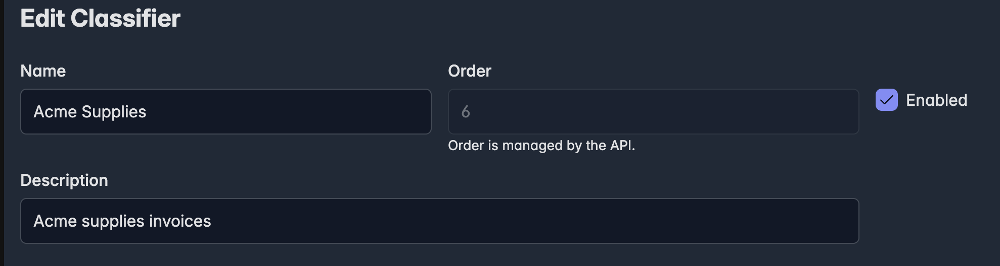
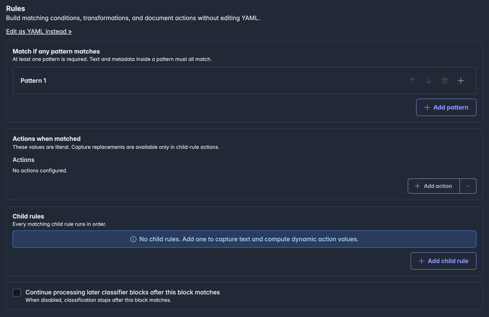
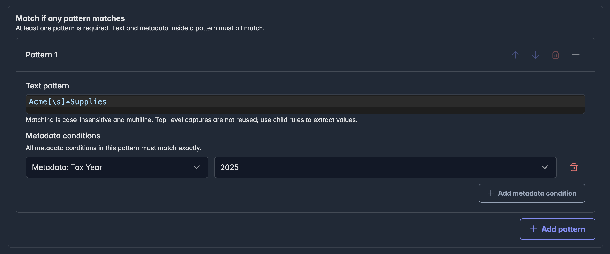
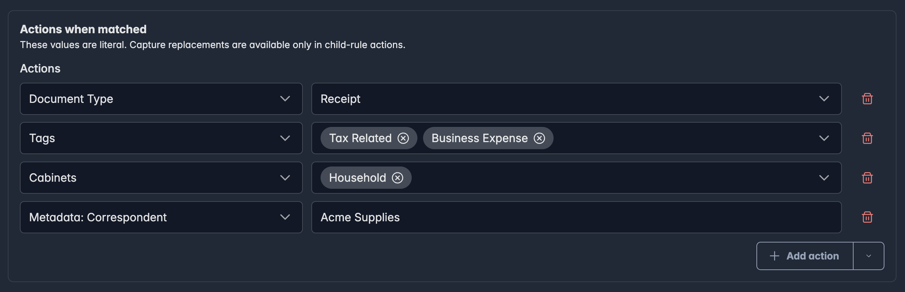
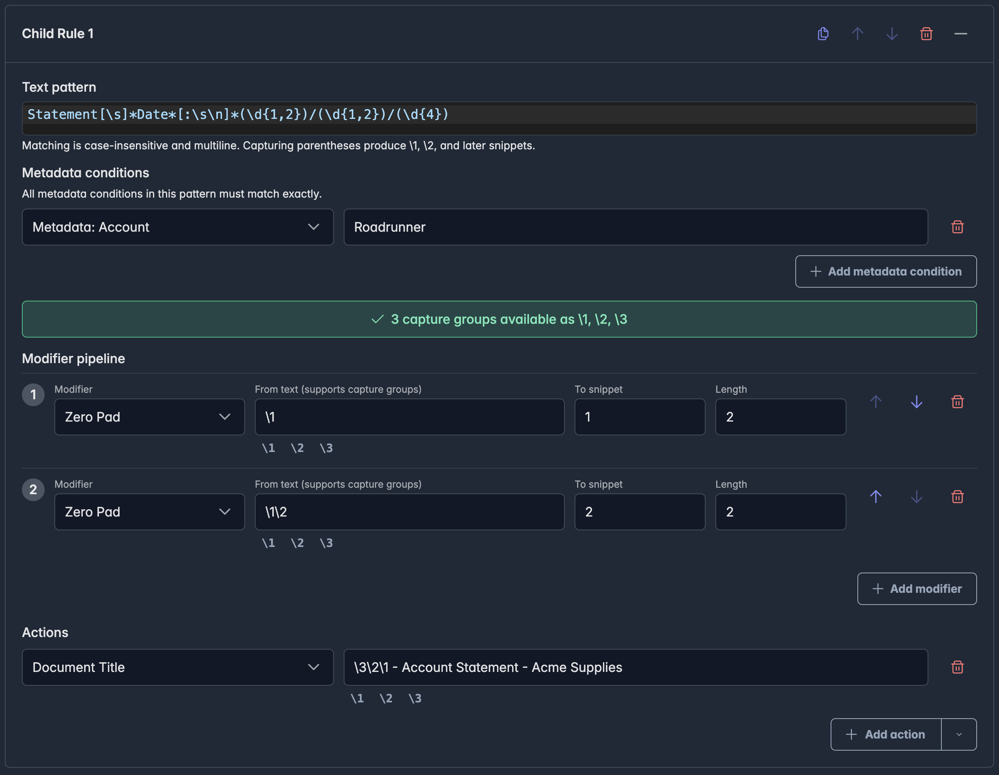

# Classifier Blocks

A classifier block is an ordered rule set that recognizes document text or metadata and computes actions for a document.  Actions can set the document type, title, tags, cabinets, or metadata.

Child rules expand the capabilities even further.  Text matching can capture values from document text, modifier pipelines can collect and transform those values, and actions can then apply the resulting values to the document title or metadata.

The classifier block editor provides visual controls for the normal workflow. Advanced YAML editing is still available when you need to inspect, paste, or debug the serialized rule structure.

Classifier blocks are powerful because each block can do two things:

- Decide whether the block applies to a document.
- Extract or compute values through child rules after the block applies.

## Opening The Editor

Open the Classifiers page, then create a new classifier block or edit an existing one.

The top of the form contains the block-level settings:

- Name: the human-readable block name.
- Description: optional context for other users.
- Enabled: disabled blocks are ignored during classification.
- Order: assigned and managed by the API.

{width="100%"}

## When Classifier Blocks Run

Autofile runs classifier blocks during document classification. Classification can be triggered after document processing or manually from a document action.

When classification starts, Autofile loads:

- The document record and existing document metadata.
- The document text, using extracted text first and OCR text as a fallback.
- All enabled classifier blocks.

Disabled blocks are ignored.

## Execution Order

Classifier blocks run in ascending order by their `order` field.

The Classifiers page shows the block order and allows reordering when the list is sorted by order ascending.

Order matters because:

- Earlier blocks run first.
- Earlier blocks can compute actions that later blocks use for metadata matching.
- Later actions overwrite earlier actions with the same key.
- A matching block can stop the entire classification run unless the continue option is enabled.

## The Rules Editor

The Rules section is organized in the same order Autofile evaluates a block:

- Match patterns decide whether the block applies.
- Actions when matched run as soon as the block matches.
- Child rules run after the block matches and can extract more specific values.
- The continue checkbox controls whether later classifier blocks still run after this block matches.

{width="100%"}

Use the visual editor for normal changes. Use **Edit as YAML instead >>** only when you need direct access to the serialized rule structure.

## Match Patterns

Top-level match patterns decide whether a block applies to a document.

The block matches when any top-level pattern matches. If no top-level patterns are configured, the block matches every document that reaches it. Inside a single pattern, all configured conditions must match.

Each pattern can contain:

- Text: a regular expression matched against the document text.
- Metadata conditions: exact string comparisons against computed actions or stored document metadata.

{width="100%"}

Text matching is case-insensitive and multiline. Metadata matching checks computed actions first, then existing document metadata.

Use **Add pattern** to add another top-level pattern. Use the pattern controls to move or remove patterns.

## Actions When Matched

Actions are key-value pairs computed when the block matches. The visual editor exposes known action types in the action dropdown.

{width="100%"}

Common actions include:

| Action | Effect |
| --- | --- |
| Suggested document type | Sets the document type. |
| Suggested filename | Sets the document title. |
| Suggested tags | Adds tags. |
| Suggested cabinets | Adds the document to cabinets. |
| Metadata Type | Sets document metadata. |
| Scratch value | Stores a temporary value for later rules. |

The referenced Document Type, tag, cabinet, and Metadata Type records must already exist. Unknown tag and cabinet slugs are skipped. Unknown metadata slugs are logged and skipped.

Classifier metadata must be associated with the resulting Document Type. Date and Lookup values must pass the same validation as values entered on the document's [Metadata page](document-metadata.md). Invalid values for known fields fail classification rather than being skipped.

Use the **Add action** split button to add a normal action. Open the dropdown side of the same button to add a scratch action.

!!! warning "Classifier updates are not atomic"
    Classifier actions are persisted in stages. A title, Document Type, tag, or cabinet change may already have been saved if a later metadata value fails validation. Review the document after correcting a failed classifier run.

## Computed Actions

Autofile stores intermediate classification results in a map called computed actions. The map is built during classification and persisted only after the classification flow completes.

Computed actions are important because:

- Actions when matched write into computed actions.
- Matching child rules write into computed actions.
- Later actions with the same key overwrite earlier values.
- Metadata patterns check computed actions before stored document metadata.
- The metadata modifier can copy a computed action into a child-rule snippet.

## Child Rules

Child rules run only after the top-level block matches. Autofile evaluates every child rule in order. Child rules do not stop after the first match; every matching child rule applies its actions.

{width="100%"}

Each child rule contains:

- Pattern: text and metadata conditions that decide whether the child rule runs.
- Modifier pipeline: optional transformations that create additional snippets.
- Actions: values computed when the child rule matches.

Use child rules to extract specific values after a document has already been recognized by the parent block. For example, a top-level pattern might recognize an invoice, while child rules extract invoice number, invoice date, account number, or total amount.

Use the child rule controls to duplicate, move, or remove child rules. Use **Add child rule** to add another rule at the bottom of the list.

<!-- TODO  -->

## Captures And Snippets

When a child rule text pattern uses regular expression capture groups, those captures become snippets.

For example, a pattern that captures an invoice number makes the first capture group available as `\1`. The structured editor shows available captures as insertable buttons. Child actions can insert snippets into values.

These snippets are replacements applied after a child pattern matches, not regex backreferences. Rust regular expressions do not support using `\1` inside the text pattern itself.

Modifiers can create additional snippets. For example, a child rule can capture `7`, use a zero-pad modifier to produce `0007`, and then store the padded value in an action.

Use the [classifier rules YAML reference](../reference/classifier-rules-yaml.md) when you need exact escaping rules for snippets in Advanced YAML mode.

## Modifier Pipelines

Modifier pipelines transform captured values or computed actions into new snippets that later actions can use.

Common modifier uses include:

- Normalize dates.
- Convert month names to month numbers.
- Compute month start or month end dates.
- Pad account numbers.
- Clean currency values.
- Compose values from captures and computed actions.

Modifiers run in order. Each modifier writes to a numbered snippet. Later modifiers and child-rule actions can use snippets produced earlier in the same child rule.

## Scratch Values

Scratch values are temporary computed actions whose names start with `_` but are not built-in suggestions.

Scratch values are useful when you need an intermediate value that should not be written to the final document. They can be matched by later patterns or copied by modifier pipelines, but they are ignored during persistence.

The editor displays scratch values as `Scratch: _name`.

Common uses include:

- Store a normalized account number for later child rules.
- Store a detected vendor key before a later block assigns tags or metadata.
- Keep a temporary date or category used only during classification.

## Continue Or Stop

Most classifier blocks should stop classification after they match. This is useful when a block fully classifies a document.

Enable **Continue processing later classifier blocks after this block matches** when the block should feed later blocks. This is useful for layered classification, such as first detecting a vendor and then letting later vendor-specific blocks extract dates or account numbers.

When the continue option is disabled, classification stops after this block matches. When it is enabled, Autofile applies this block's actions and then continues to the next enabled block.

## Example: Simple Document Type

To recognize invoices and assign a document type:

- Add a top-level match pattern with text such as `invoice`.
- Add an action for the suggested document type.
- Select the invoice Document Type.
- Leave child rules empty if no values need to be extracted.
- Leave the continue option disabled if this block fully classifies the document.

## Example: Extract An Invoice Number

To classify an invoice and extract its invoice number:

- Add a top-level match pattern that recognizes invoices.
- Add an action for the suggested document type.
- Add a child rule.
- In the child rule pattern, use a text expression that captures the invoice number.
- In the child rule actions, set the invoice number metadata field using the capture snippet shown by the editor.

## Example: Layered Classification

To detect a vendor first and let later blocks use that detection:

- Create an early block that matches the vendor name.
- Add a metadata or scratch action that records the detected vendor value.
- Enable the continue option.
- Create a later block with a metadata condition that checks the computed vendor value.
- Add the later block's final document type, tag, cabinet, or metadata actions.

## Example: Dates And Periods

To extract a statement date and compute the beginning and end of that month:

- Add a top-level pattern that recognizes the statement.
- Add a child rule that captures the statement date.
- Add modifier pipeline steps for month start and month end.
- Add actions for the original statement date and the generated period dates.

## Testing A Classifier Block

Open a document and use the Classifier Test page to test a single classifier block against that document.

The test result shows computed actions in a serialized format. This is useful for confirming that a block matches and that child rules produce the expected values.

!!! warning "Single-block tests"
    Testing evaluates the selected classifier block by itself. It does not simulate earlier blocks unless the selected block computes the same actions internally.

## Advanced YAML

Use **Edit as YAML instead >>** when you need to inspect or directly edit the underlying rule structure.

Advanced YAML is useful for:

- Pasting a rule created elsewhere.
- Reviewing exact serialized keys.
- Making bulk edits.
- Debugging validation errors with the [classifier rules YAML reference](../reference/classifier-rules-yaml.md).

For normal editing, prefer the visual editor.

<!-- TODO screenshot: Advanced YAML dialog -->

## Writing Safe Rules

- Start with a disabled block while drafting.
- Test against documents that should match and documents that should not match.
- Prefer specific top-level match patterns so a block does not classify unrelated documents.
- Use the continue option only when later blocks intentionally depend on earlier computed actions.
- Keep metadata, tag, cabinet, and document type choices consistent with existing records.
- Prefer the visual editor for normal changes.
- Use the [classifier rules YAML reference](../reference/classifier-rules-yaml.md) for exact serialized syntax.
