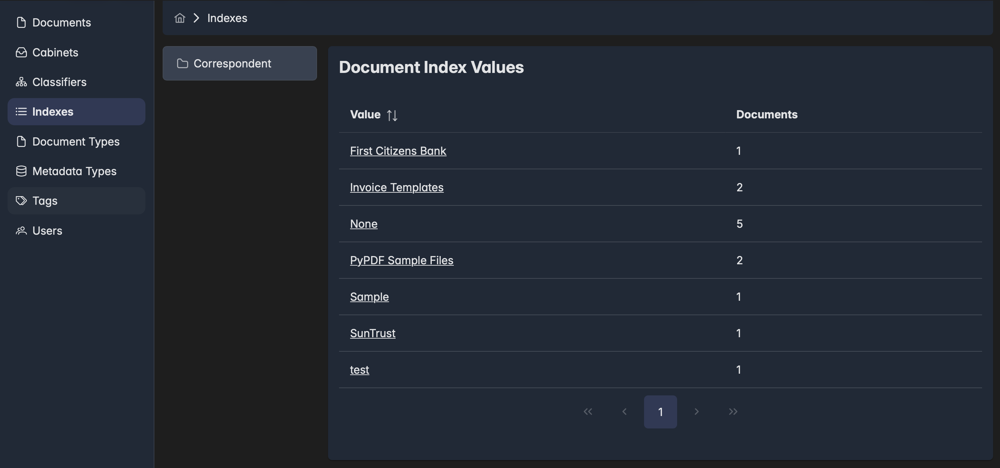
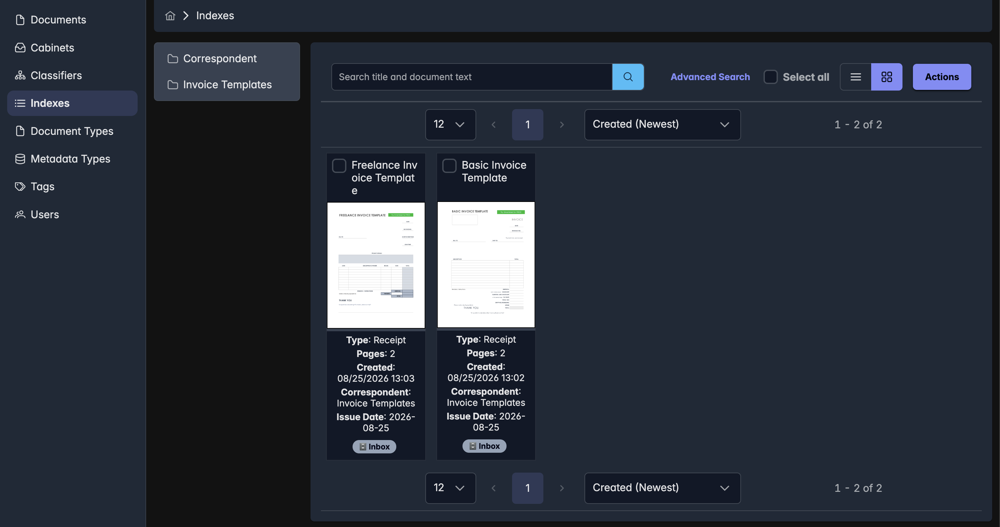

# Indexes

Document indexes organize documents into browseable groups generated from document properties and metadata. For example, an index can group documents by correspondent, by issue year and month, or by a combination of both.

{ align=left width="100%" style="margin: 0 0 1rem 0;" }
{ align=left width="100%" style="margin: 0 0 1rem 0;" }

## How Indexes Work

An index consists of three parts:

- A **document index** defines the name and overall purpose of the index.
- **Index templates** describe how to generate each level of the hierarchy.
- **Index values** are the rendered groups that users browse.

Templates form a tree. A template with no parent creates the root level, and a template with the root as its parent creates the next level beneath it, and so on. The tree can have multiple root levels. A template marked **Is Leaf** ends a branch and associates matching documents with the rendered value.

For example, an index with a year template and a child month template can produce this hierarchy:

```text
2025
  11
  12
2026
  01
```

The year template is not a leaf because users continue from a year into its months. The month template is a leaf because selecting a month opens its documents.

Every usable branch must reach a template marked **Is Leaf**. Autofile will not save a partial path when a branch ends without a leaf.

## Create An Index

1. Open **Indexes** from the main navigation.
2. Select **New Document Index**.
3. Enter a **Slug**, **Name**, and optional **Description**.
4. Leave **Enabled** selected if document changes should update the index automatically.
5. Select **Save**.

The slug is a stable identifier and cannot be changed after the index is created. It may contain lowercase letters, numbers, hyphens, and underscores.

The index is initially empty because it does not have any templates. Open the index row's action menu and select **Edit Templates** to define its hierarchy.

## Create Index Templates

Select **New Document Index Template** for each level of the index. Configure these fields:

| Field | Description |
| --- | --- |
| **Template** | A MiniJinja template that renders the value for this level. |
| **Parent Template** | The preceding level in the hierarchy. Leave this empty for a root template. |
| **Is Leaf** | Ends the branch and associates documents with its rendered values. |
| **Enabled** | Stored with the template. See the current limitation below. |

Create and save a parent template before creating its child so that the parent appears in the **Parent Template** list.

!!! warning "Template Enabled limitation"
    The template-level **Enabled** setting is not currently applied when Autofile builds an index. All templates are evaluated. The index-level **Enabled** setting does control whether document changes queue automatic index updates.

## Write Templates

Index templates use [MiniJinja syntax](https://docs.rs/minijinja/latest/minijinja/syntax/). Autofile supplies the current document as `doc`.

Use an output expression to turn a document value into an index value:

```jinja
{{ doc.title }}
```

Metadata is a map keyed by metadata type slug. Bracket notation makes the key explicit:

```jinja
{{ doc.metadata["correspondent"] }}
```

The template context contains these fields:

| Field | Value |
| --- | --- |
| `doc.id` | Document ID. |
| `doc.title` | Document title. |
| `doc.document_type_id` | Document type ID. |
| `doc.document_type` | Document type slug. |
| `doc.metadata` | Metadata values keyed by metadata type slug. |
| `doc.cabinet_ids` | Cabinet IDs assigned to the document. |
| `doc.cabinets` | Cabinet slugs assigned to the document. |
| `doc.tag_ids` | Tag IDs assigned to the document. |
| `doc.tags` | Tag slugs assigned to the document. |
| `doc.created_by` | ID of the user who created the document. |
| `doc.created_at` | Document creation timestamp. |
| `doc.updated_by` | ID of the user who last updated the document. |
| `doc.updated_at` | Document update timestamp. |

### Missing And Empty Values

If a template renders an empty or whitespace-only result, Autofile skips that template and its descendants for the document. This is useful because documents without the relevant metadata do not create empty index groups.

Guard operations such as string slicing when metadata may be absent. Accessing a missing metadata item returns an undefined value, but applying another operation to that value can fail:

```jinja
{{ doc.metadata["issue_date"][:4] if doc.metadata["issue_date"] is defined }}
```

Autofile stores non-empty rendered text exactly as produced. Avoid unintended leading or trailing whitespace because it becomes part of the index value.

## Test A Template

Templates are not syntax-checked when they are saved. Test each expression against a representative document before rebuilding an index:

1. Open a document.
2. Select **Template Test** from the document menu.
3. Enter the template.
4. Select **Run Test**.
5. Confirm the rendered value or correct the reported error.

Test documents that contain the referenced metadata and documents where it is missing. The Template Test page uses the same document context and template engine as index generation.

## Example: Correspondent

This index creates one group for every value of the `correspondent` metadata field.

Create one template with no parent and select **Is Leaf**:

```jinja
{{ doc.metadata["correspondent"] }}
```

The result looks like:

```text
Acme Corporation
Example Bank
Northwind Traders
```

Selecting a correspondent opens the documents assigned to it. A document without Correspondent metadata is omitted from the index.

## Example: Issue Date By Year And Month

Issue Date metadata uses the `issue_date` slug and stores dates as `YYYY-MM-DD`. Create two templates to build separate year and month levels.

First, create a root year template. Do not select **Is Leaf**:

```jinja
{{ doc.metadata["issue_date"][:4] if doc.metadata["issue_date"] is defined }}
```

Next, create a month template. Select the year template as **Parent Template** and select **Is Leaf**:

```jinja
{{ doc.metadata["issue_date"][5:7] if doc.metadata["issue_date"] is defined }}
```

For an Issue Date of `2026-08-25`, the templates render `2026` and `08`:

```text
2025
  11
  12
2026
  01
  08
```

The zero-padded month values sort in calendar order.

## Example: Correspondent By Issue Month

This index first groups documents by Correspondent and then by the year and month of Issue Date.

Create a root Correspondent template. Do not select **Is Leaf**:

```jinja
{{ doc.metadata["correspondent"] }}
```

Create an Issue Date year-month template. Select the Correspondent template as **Parent Template** and select **Is Leaf**:

```jinja
{{ doc.metadata["issue_date"][:7] if doc.metadata["issue_date"] is defined }}
```

For an Issue Date of `2026-08-25`, the second template renders `2026-08`:

```text
Acme Corporation
  2026-07
  2026-08
Example Bank
  2025-12
  2026-01
```

The same year-month value can appear under more than one correspondent. Each occurrence belongs to its own branch.

## Build And Update An Index

After creating or changing templates, return to **Indexes**, open the index row's action menu, and select **Rebuild Index**. Rebuilding runs as a background job and processes all documents.

Template changes do not automatically rebuild existing index values. Without a rebuild, existing documents may continue to use values generated from an earlier template configuration until another document change updates them.

!!! note "Rebuild progress"
    **Rebuild Index** queues work and returns immediately. A rebuild removes the existing generated values before recreating them, so the index can appear empty or incomplete while the job is running. See [Background Jobs](../admin/background-jobs.md) if rebuilding appears stuck.

When an index is enabled, relevant document changes queue an update for that document. Autofile adds new memberships, removes stale memberships, and deletes generated values that are no longer used. Disabling an index stops new automatic update jobs but does not remove its existing values.

## Browse An Index

Open **Indexes** and select an index's slug or name to browse its generated values.

- Selecting a non-leaf value opens the next level.
- Selecting a leaf value opens the documents assigned to it.
- The **Documents** count includes distinct documents below that value and all of its descendants.
- The path menu provides navigation back through parent values and the index root.

To see where one document appears, open the document and select **Indexes**. The page lists each index membership as a complete path, such as `Acme Corporation / 2026-08`.

## Troubleshooting

If expected values or documents are missing:

- Test every template against an affected document using the **Template Test** document action.
- Confirm metadata keys use slugs such as `correspondent` and `issue_date`, not display names such as `Correspondent` and `Issue Date`.
- Confirm every branch ends at a template marked **Is Leaf**.
- Confirm child templates have the intended **Parent Template**.
- Guard operations on metadata that may be missing.
- Rebuild the index after changing its templates.
- Check the API logs and Redis connectivity if a queued rebuild does not progress.
