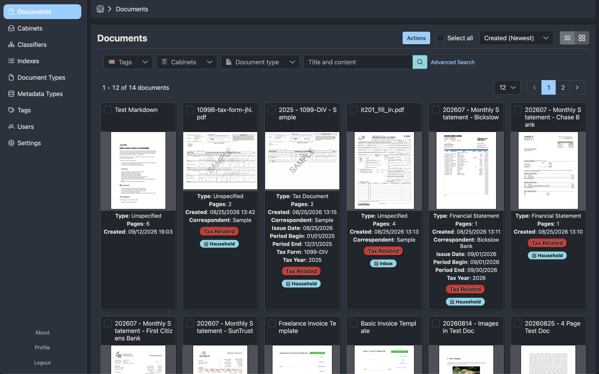

{ align=left width="180" style="margin: 0 1.25rem 1rem 0;" }

# Autofile Documentation

Autofile is a self-hosted document management application. It stores document files in S3-compatible object storage, keeps structured metadata in PostgreSQL, and provides a React web UI backed by a Rust API.

{ align=left width="100%" style="margin: 0 0 1rem 0;" }

!!! note "Alpha software"
    Autofile is relatively stable, but it is still alpha software. Expect breaking changes as installation, administration, and document-processing workflows continue to mature.

## What Autofile Provides

- Upload and manage document files.
- Organize documents with cabinets and tags.
- Define document types and metadata types.
- Build document indexes and reusable index templates.
- Run classifier blocks for classification workflows.
- Store files in S3-compatible object storage such as MinIO.
- Process previews, text, OCR, and thumbnails through background jobs.
- Manage users with JWT and cookie-based authentication.

## Quick Links

- [Quick Start](getting-started/quick-start.md)
- [Create the First User](getting-started/first-user.md)
- [Configuration](admin/configuration.md)
- [Development](development/index.md)
- [API Reference](reference/api.md)

## Architecture

Autofile is built as two containers:

- `autofile-api`: Rust/Axum API, background workers, PostgreSQL migrations, S3 file storage, and document processing tools.
- `autofile-ui`: React/Vite frontend served by nginx.

The supporting services are PostgreSQL, Redis, and S3-compatible object storage.
